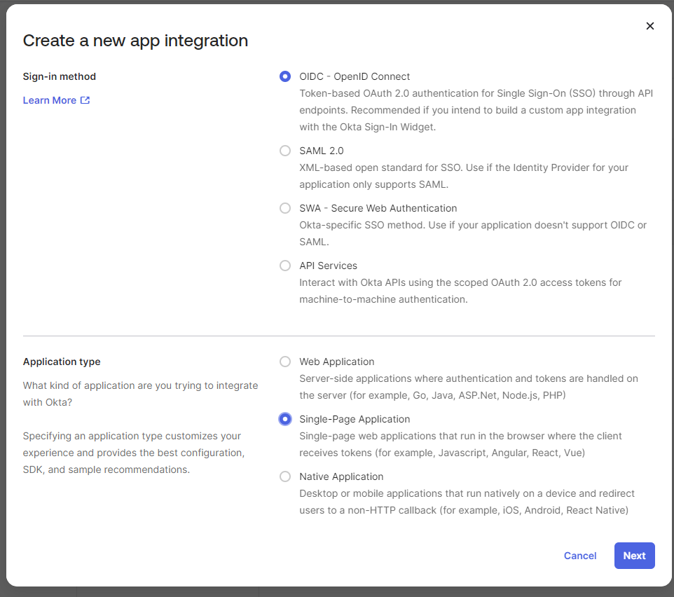
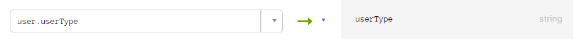
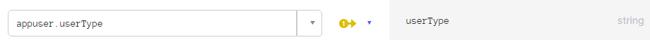
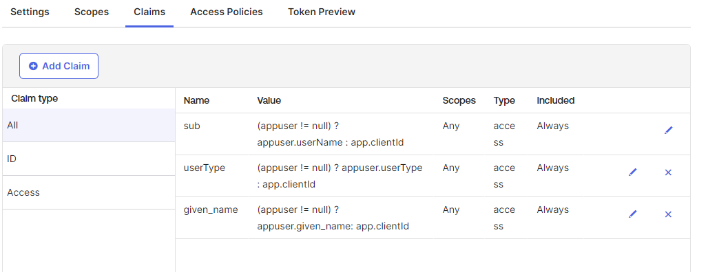
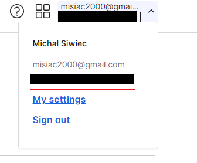
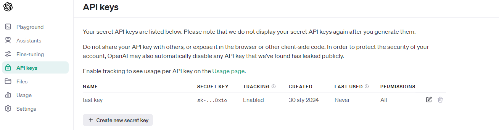
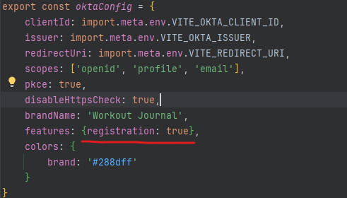

# How to Deploy Workout Journal

This guide will walk you through the steps to deploy the Workout Journal application.

## Prerequisites

Before you begin, ensure you have the following:

- OpenAI Account
- Okta account
- Docker

## Step 1: Creating env file

1. Create a `.env` file in the root of the project with the following content:

```bash
OKTA_CLIENT_ID = # Your Okta Client ID
OKTA_ISSUER = # Your Okta Issuer
OPENAI_KEY = # Your OpenAI Key
```

## Step 2: Setting up Okta

Okta is an identity and access management platform. It's used in this project for user authentication.

1. In Settings -> Account -> Embedded widget sign-in support. Enable Interaction Code.
2. In Security -> API. Select pencil icon on the default authorization server. In the settings, in access policies,
   select pencil icon on default policy, and check the "Interaction Code" box.
3. In Application -> Applications. Create new Single-Page App Integration on Okta website with OIDC Sign-in method with
   the following values:
    * Grant types: Authorization Code, Interaction Code, Refresh Token
    * Redirect URI: YOUR_FRONTEND_URL/login/callback
    * Sign-out Redirect URI: YOUR_FRONTEND_URL
    * Federation Broker Mode: Enabled

   
4. In Directory -> Profile Editor. Click your app user and add following attribute:
    * Display Name: User Type
    * Variable name: userType
    * User permission: Read-write
    * Left all other values default.
    * In your app Mappings, ensure you have the following mappings:
      * User to App:
      
        
      * App to User
      
        
      
5. In Security -> API. Select pencil icon on the default authorization server. In the settings, in claims add following
   claims with the following values:

   
6. Copy the Client ID from Applications -> Applications, and paste it into the `.env` file.
7. Get the Okta Company name from upper right corner and paste replace the value in: 
   ``` bash 
   https://YOUR-OKTA-COMPANY-NAME/oauth2/default
   ```
   
8. Paste the result into `.env` file as an issuer

## Step 3: Setting up OpenAI


OpenAI is an artificial intelligence research lab. In this project, it's used for workout analysis and generating personalized workout plans.

1. In the OpenAI api platform, ensure you have the credits to use the GPT-3.5 model (You can buy them in Settings -> Billing)
2. Create and copy the API key then paste it into the `.env` file.

   

## Step 4: Enabling User Registration

User registration is disabled by default. To enable it, modify the `oktaConfig.ts` file:

1. Open `src/lib/oktaConfig.ts` in wj-frontend.
2. Find the `registration`.
3. Change it from `false` to `true`.



## Step 5: Setting up Docker Compose

1. Open docker-compose.yml, and replace the args and env variables with your own values. If you just want to test the
   application, you can leave the default localhost values.
2. Configure ports for your environment. Leave the default ports if you want to test the application.
3. Run `docker-compose up` to start the application.
4. Access the application at a chosen port.

| Value                               | Description                               |
|-------------------------------------|-------------------------------------------|
| VITE_REDIRECT_URI                   | The redirect URI for the frontend.        |
| VITE_API_ADDRESS                    | The address of the backend.               |
| ALLOWED_ORIGINS                     | The allowed origins for CORS.             |
| DATASOURCE_HOSTNAME                 | The hostname for the database.            |
| DATASOURCE_PORT                     | The port for the database.                |
| DATASOURCE_DB_NAME                  | The name of the database.                 |
| DATASOURCE_USERNAME, MYSQL_USER     | The username for the database.            |
| DATASOURCE_PASSWORD, MYSQL_PASSWORD | The password for the database.            |
| MYSQL_ROOT_PASSWORD                 | The root password for the MySQL database. |
| MYSQL_DATABASE                      | The name of the MySQL database.           |


