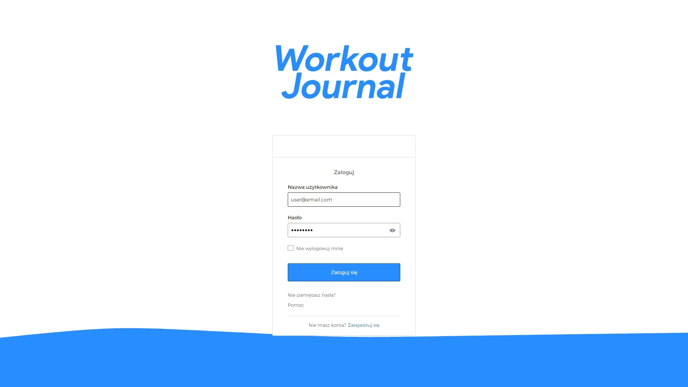
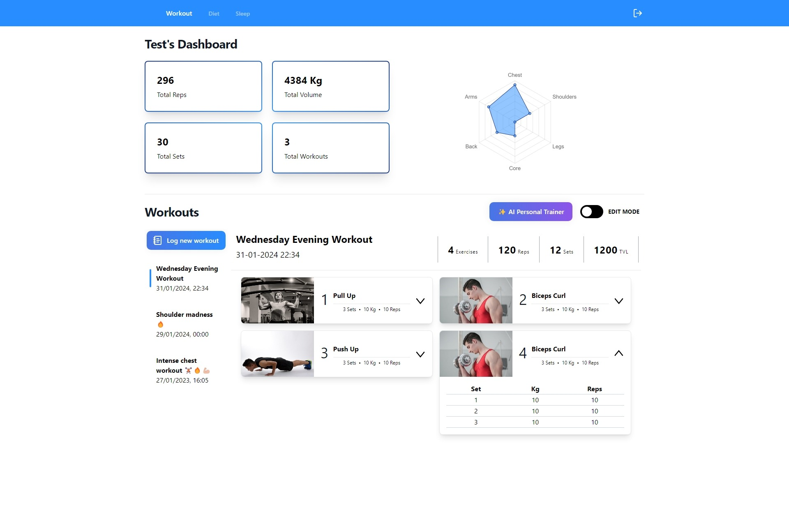

<h1 align="center">
 
</h1>

<h4 align="center">
Workout Journal is your go-to fitness companion. It offers a user-friendly interface that makes analyzing and analyzing your fitness journey effortless.
With Okta's secure user authentication, your data is always safe.
The application provides detailed analysis of your workout sessions and generates personalized workout plans that are tailored to your individual preferences.
Experience a new level of fitness tracking with Workout Journal.
</h4>
<p align="center">
	<a href="#description">Description</a> •
  <a href="#key-features">Key Features</a> •
  <a href="#requirements">Requirements</a> •
  <a href="#how-to-use">How To Use</a> •

</p>
 

## Key Features

* Log Workout Sessions
    - Easily record workout sessions, including exercises performed, duration, and intensity

* Comprehensive Statistics
    - Track your progress with detailed statistics for each workout and overall performance metrics.

* AI Workout Analysis
    - Obtain in-depth analysis of your workout sessions using OpenAI's AI capabilities, including performance insights
      and improvement recommendations

* AI-Generated Personalized Workout Plans
    - Receive customized workout plans based on personal fitness goals, preferences, and other factors.

* User Authentication with Okta
    - Securely authenticate users and manage access to the application with Okta integration

 

## How To Use

Access the app deployed on ... tbd
or follow the instructions below to deploy the application for yourself

To clone the repo, use:

```bash
git clone https://github.com/Misiac/workout-journal.git
```

Refer to the [How to Deploy Workout Journal](howToDeploy.md) guide for detailed instructions on deploying the
application.

## What's Left?

- This very readme
- Dark mode
- Exercise list
- Refresh workout name/date in slider
- Cleanup frontend code
- Logo
- Rework navbar
- Data parser from some mobile app
- Backend logs
- More tests coverage

## Built with:

**Backend:**

- Spring Boot, MySQL

**Frontend:**

- TypeScript, React

- **Testing:**

- Mockito, JUnit 5

**Services/APIs:**

- Okta, OpenAI

**DevOps:**

- Docker